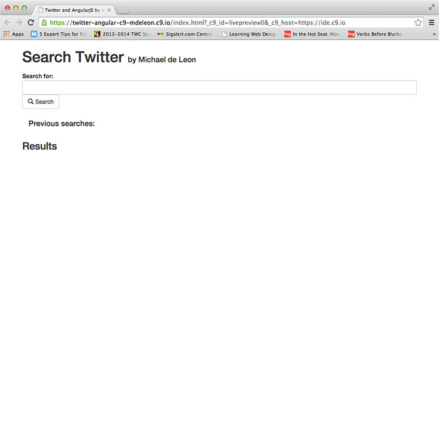
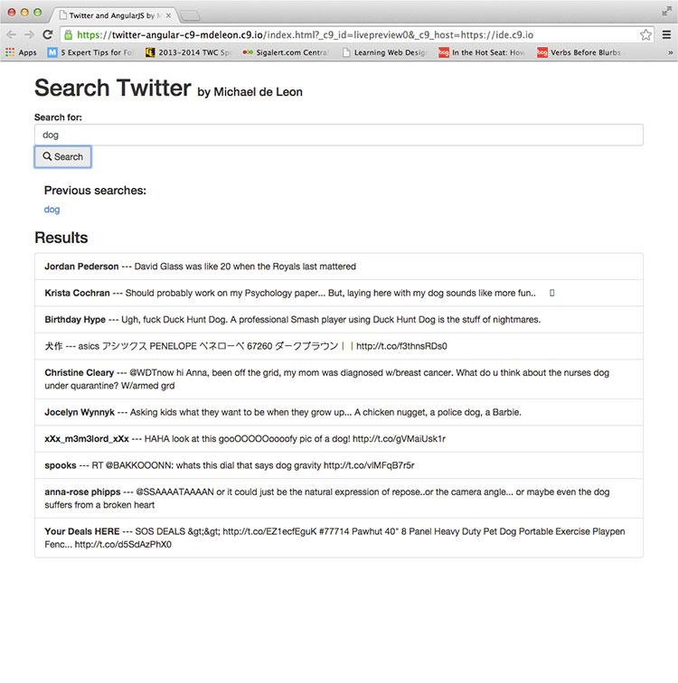
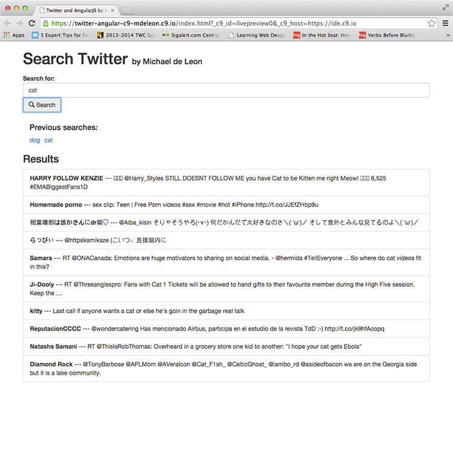
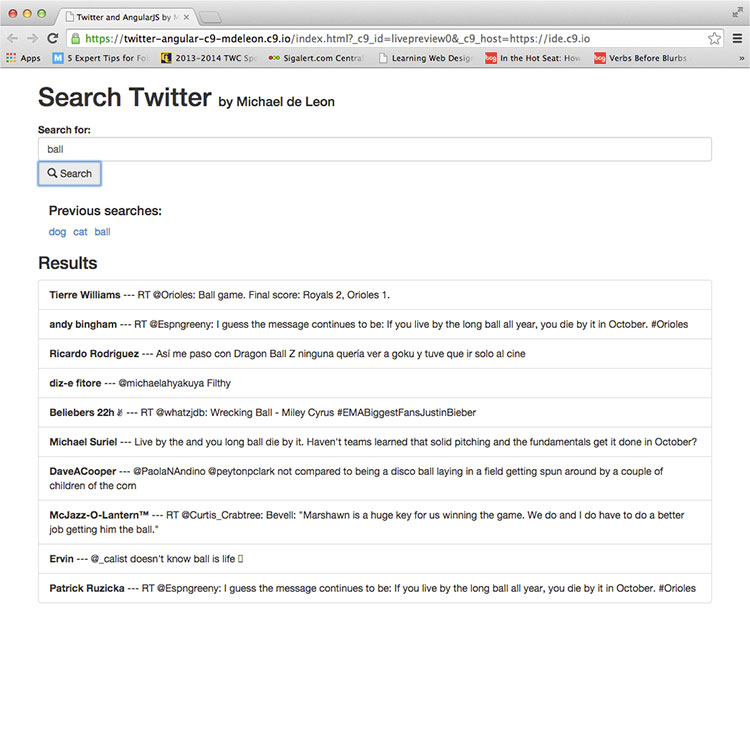

  
`School Work - Advanced Web Design Class - ITI-323`  

# Dates:  
2013 - 2014  
# Technologies:  
Cloud9, HTML5, CSS3, Bootstrap 3, AngularJS  
# Description:  
This assignment is similar to the jQuery version except that this is in AngularJS.  It searches Twitter for search terms and gives back the results.  History of previous searches are saved.  The site was created with HTML5, CSS3, Bootstrap 3, AngularJS in [Cloud9 - https://c9.io](https://c9.io/).  
# Screenshots:
  

  

  

  
